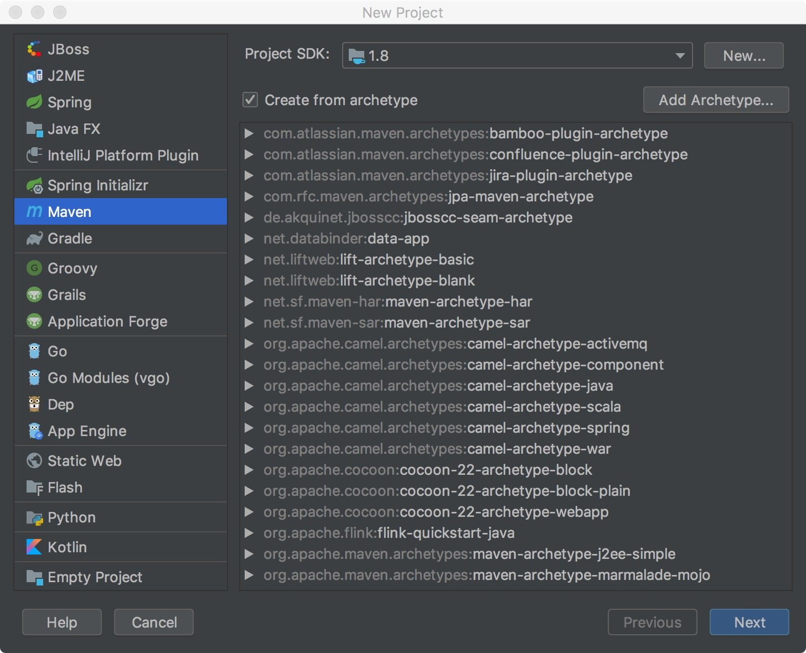
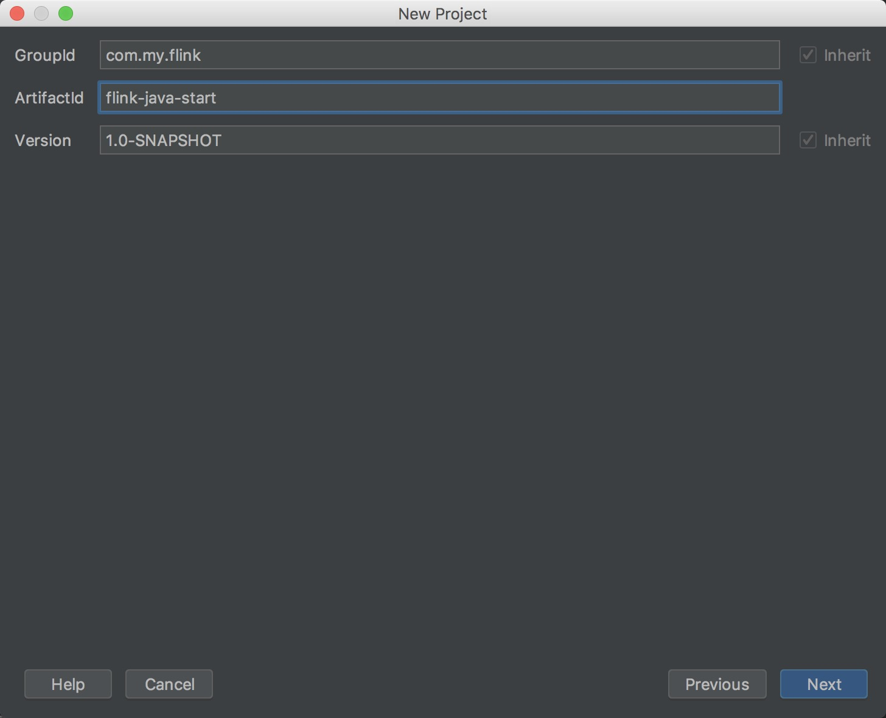
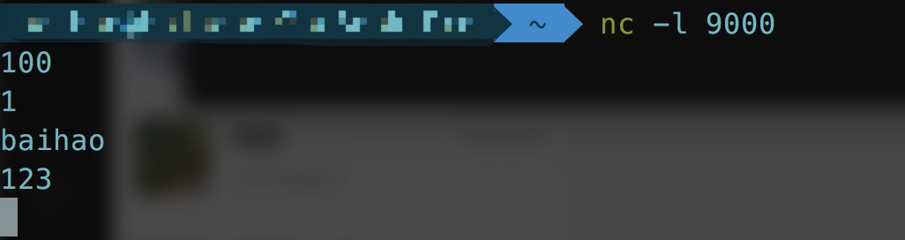
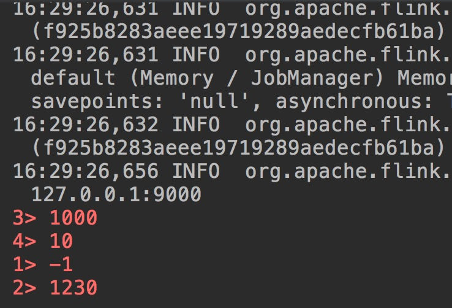

# flink 流式处理小栗子

这篇文章以一个简单的栗子来介绍一下 flink 流式处理

## 创建一个 flink 的 maven 工程

首先用IDEA创建一个maven工程




然后一路确认选择项目的路径即可

## 小栗子-1

👇是第一个小栗子，我们创建一个 String 数组，然后 flink 什么都不做，直接 print 到输出流中

```java
package com.my.flink;

import org.apache.flink.streaming.api.environment.StreamExecutionEnvironment;

public class SocketTextStreamWordCount {
    public static void main(String[] args) throws Exception {
        // 创建一个 flink 执行的环境
        final StreamExecutionEnvironment env = StreamExecutionEnvironment.getExecutionEnvironment();
        
        String[] strs = new String[]{"hello", "world", "and", "flink"};
        
        // flink 从 strs 生成源，然后直接 print 到输出流
        env.fromElements(strs).print();
        	
        // 开始执行
        env.execute("simple flink test");
    }
}
...

4> world
3> hello
2> flink
1> and
```

## 小栗子-2

👇是第二个小栗子，我们从一个 socket 中获取 int 数据，然后将流中的每个 int 数据 * 10，然后输出到错误流中

```
package com.my.flink;

import org.apache.flink.api.common.functions.MapFunction;
import org.apache.flink.streaming.api.datastream.DataStream;
import org.apache.flink.streaming.api.environment.StreamExecutionEnvironment;

public class SocketTextStreamWordCount {
    public static void main(String[] args) throws Exception {
        final StreamExecutionEnvironment env = StreamExecutionEnvironment.getExecutionEnvironment();

        String host = "127.0.0.1";
        int port = 9000;
        // 这里从 socket 中创建一个 source
        DataStream<String> source = env.socketTextStream(host, port);
        source.map(new MapFunction<String, Integer>() {
            @Override
            public Integer map(String value) throws Exception {
                try {
                    int mapValue = Integer.valueOf(value);
                    return mapValue * 10;
                } catch (Exception e) {
                    return -1;
                }
            }
        }).printToErr();

        env.execute("simple flink test");
    }
}
```

我们开启一个 host 为 127.0.0.1，port 为 9000 的 server



flink 的输出为



## 打包提交 flink 执行

我们可以进入 flink 工程目录，使用如下命令打包

```
$ mvn clean package -Dmaven.test.skip=true
```

进入flink安装目录执行以下命令跑程序

```
$ /bin/flink run -c com.my.flink.SimpleExample /your/path/target/original-flink-java-start-1.0-SNAPSHOT.jar
```

## 总结

本文用两个简单的栗子简要介绍了 flink 的执行流程～
