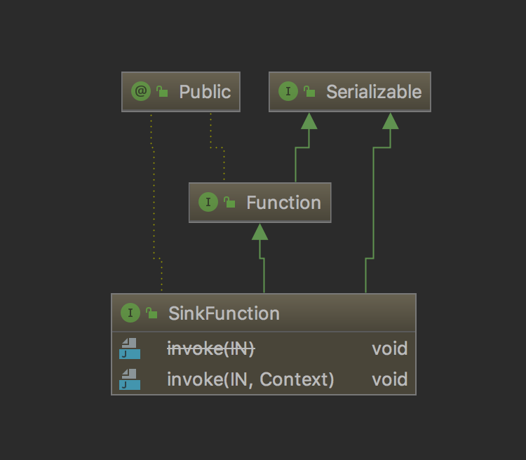

# flink 的 DataSink

这篇文章介绍一下 flink 的 DataSink，sink 是下沉的意思，DataSink 指代将 flink 处理过的流元素下沉到某个地方去

上一篇文章我们介绍了 DataSource，source 就是数据的来源，flink 对 source 生成的流元素可以做一系列的操作，操作完后就把计算后的数据结果 sink 到某个地方（可以是 MySQL、ElasticSearch、Kafka、Redis等）

## SinkFunction



从上图可以看到 SinkFunction 接口有 invoke 方法，sink 操作就是对每一个流元素执行 invoke 方法

flink 中有一个 RichSinkFunction 抽象类集成 SinkFunction，flink 提供的 SinkFunction 都是继承 RichSinkFunction

这里就拿个较为简单的 PrintSinkFunction 来讲解一下

## PrintSinkFunction

```java
final StreamExecutionEnvironment env = StreamExecutionEnvironment.getExecutionEnvironment();
    
Integer[] integers = new Integer[]{1, 2, 3, 4};
env.fromElements(integers).print();
```

上面代码中的 print 以及类似的 printToErr 内部都生成了 PrintSinkFunction，通过 `addSink(PrintSinkFunction)` 生成 StreamSink（addSink 方法在前面的文章中有讲到，这里就不重复了），print 将元素输出到 sysout 流，printToErr 将元素输出到 syserr 流

下面我们来看一下 PrintSinkFunction 的源码

```java
public class PrintSinkFunction<IN> extends RichSinkFunction<IN> {

	private static final long serialVersionUID = 1L;
	
	// 真正将流元素输出到 sysout/syserr 的 writer
	private final PrintSinkOutputWriter<IN> writer;
	
	// stdErr 为 true 的话输出到错误流，反之输出到输出流
	public PrintSinkFunction(final String sinkIdentifier, final boolean stdErr) {
		writer = new PrintSinkOutputWriter<>(sinkIdentifier, stdErr);
	}

	@Override
	public void open(Configuration parameters) throws Exception {
		super.open(parameters);
		StreamingRuntimeContext context = (StreamingRuntimeContext) getRuntimeContext();
		// context.getIndexOfThisSubtask() 指代本 task 位于并行 task 的下标
		// context.getNumberOfParallelSubtasks() 指代 task 的并行度
		writer.open(context.getIndexOfThisSubtask(), context.getNumberOfParallelSubtasks());
	}
	
	// 处理流元素
	@Override
	public void invoke(IN record) {
		writer.write(record);
	}
}
```

可以看到，PrintSinkFunction 通过 PrintSinkOutputWriter 来将元素输出到输出流/错误流，我们接着来看游戏 PrintSinkOutputWriter 的源码

```java
public class PrintSinkOutputWriter<IN> implements Serializable {
	public void open(int subtaskIndex, int numParallelSubtasks) {
		// get the target stream
		// 得到目标流
		stream = target == STD_OUT ? System.out : System.err;
		// completedPrefix 主要用来指示当前是哪个 task 的输出，让用户在控制台测试的时候清晰的看到
		completedPrefix = sinkIdentifier;

		if (numParallelSubtasks > 1) {
			if (!completedPrefix.isEmpty()) {
				completedPrefix += ":";
			}
			completedPrefix += (subtaskIndex + 1);
		}

		if (!completedPrefix.isEmpty()) {
			completedPrefix += "> ";
		}
	}
	
	// 输出元素到 stream
	public void write(IN record) {
		stream.println(completedPrefix + record.toString());
	}
}
```

## 自定义 sink

调用 `SingleOutputStreamOperator.addSink(new PrintSinkFunction<>()` 即可，比较简单，就不给出栗子了

## 总结

今天这篇文章，我们介绍了 flink 中的 DataSink，希望大家有所收获