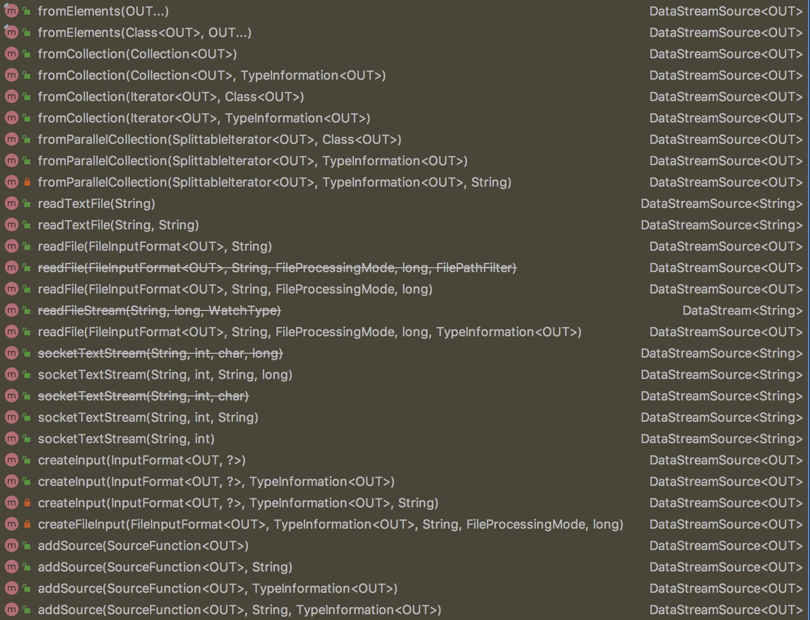
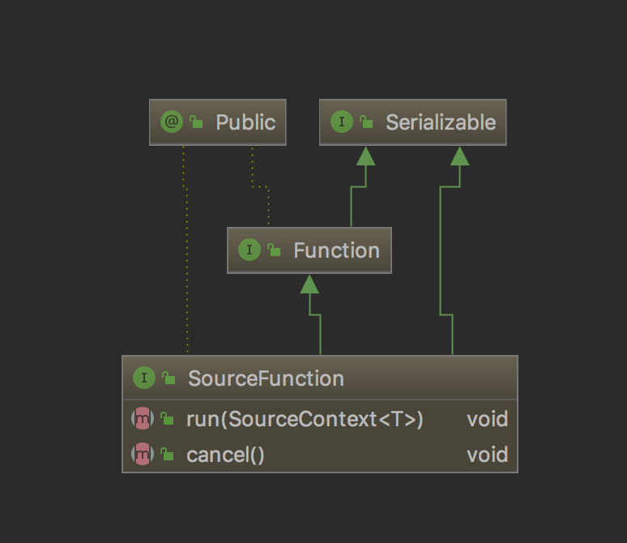

# flink 的 DataSource

这篇文章介绍一下 flink 的 DataSource，从字面上就能看出来，DataSource 是数据源的意思

flink 作为一款流式计算框架，可以用于做批处理，处理历史的、静态的数据；也可以用来做流处理，处理不断到来的元素，DataSource 可以理解为流元素的源头

Flink 中你可以使用 `StreamExecutionEnvironment.addSource(sourceFunction)` 来为你的程序添加数据来源，也可以使用 flink 提供的 API，如下图所示



DataSource 大致分为基于本地集合的 source、基于文件的 source、基于 socket 的 source 以及自定义的 source 四类，下面我们分别来看看这四类 source 是如何产生元素的

## SourceFunction

在介绍四种 source 之前，我们首先来看看 SourceFunction，SourceFunction 是所有 stream source 的根接口，定义了两个接口方法



1. run：启动一个 source，即对接一个外部数据源然后 emit 元素形成 stream（大部分情况下会通过在该方法里运行一个 while 循环的形式来产生 stream）
2. cancel：取消一个 source，也即将 run 中的循环 emit 元素的行为终止

## 基于本地集合的 source

```java
final StreamExecutionEnvironment env = StreamExecutionEnvironment.getExecutionEnvironment();
Integer[] integers = new Integer[]{1, 2, 3, 4};
    
env.fromElements(integers).printToErr();
```

上图中我们使用 `env.fromElements(integers)` 创建了 DataSource，下面我们看看源码是如何实现的（已省略不重要代码）

```java
public final <OUT> DataStreamSource<OUT> fromElements(OUT... data) {
	return fromCollection(Arrays.asList(data), typeInfo);
}
```

可以看到，fromElements 方法将传入的数组包装成为集合，然后调用了 fromCollection 方法

```java
public <OUT> DataStreamSource<OUT> fromCollection(Collection<OUT> data, TypeInformation<OUT> typeInfo) {
	SourceFunction<OUT> function;
	try {
		function = new FromElementsFunction<>(typeInfo.createSerializer(getConfig()), data);
	}
	catch (IOException e) {
		throw new RuntimeException(e.getMessage(), e);
	}
	return addSource(function, "Collection Source", typeInfo).setParallelism(1);
}
```

fromCollection 创建一个了一个 FromElementsFunction，易得，FromElementsFunction 实现了 SourceFunction，用于生成流元素，最后调用了 addSource 方法生成 StreamSource，addSource 方法在上一篇文章中有讲到，这里就不重复了，最后调用了 `setParallelism(1)` 设置流的并行度为 1

```java
public class FromElementsFunction<T> implements SourceFunction<T>, CheckpointedFunction {

	private volatile boolean isRunning = true;

	@Override
	public void run(SourceContext<T> ctx) throws Exception {
		final Object lock = ctx.getCheckpointLock();

		while (isRunning && numElementsEmitted < numElements) {
			T next = serializer.deserialize(input);
			synchronized (lock) {
				ctx.collect(next);
				numElementsEmitted++;
			}
		}
	}

	@Override
	public void cancel() {
		isRunning = false;
	}
}
```

FromElementsFunction 实现了 SourceFunction 定义的两个方法，可以看到，run 方法在一个 while 循环内不断通过 `ctx.collect()` emit 流元素，cancel 方法可以通过将 isRunning 设置为 false 来中止 run 方法的循环

## 基于文件的 source

```java
final StreamExecutionEnvironment env = StreamExecutionEnvironment.getExecutionEnvironment();

DataStream<MyEvent> stream = env.readFile(
        myFormat, myFilePath, FileProcessingMode.PROCESS_CONTINUOUSLY, 100,
        FilePathFilter.createDefaultFilter(), typeInfo);
```
readFile 方法根据给定的 fileInputFormat 和读取路径读取文件。根据提供的 watchType，这个 source 可以定期（每隔 interval 毫秒）监测给定路径的新数据（FileProcessingMode.PROCESS_CONTINUOUSLY），或者处理一次路径对应文件的数据并退出（FileProcessingMode.PROCESS_ONCE）。你可以通过 pathFilter 进一步排除掉需要处理的文件

## 基于 socket 的source

```java
final StreamExecutionEnvironment env = StreamExecutionEnvironment.getExecutionEnvironment();

String host = "127.0.0.1";
int port = 9000;
// 这里从 socket 中创建一个 source
DataStream<String> source = env.socketTextStream(host, port);
```

这是前面文章中出现过的小栗子，我们从源码角度再来看看

```java
public DataStreamSource<String> socketTextStream(String hostname, int port, String delimiter, long maxRetry) {
	return addSource(new SocketTextStreamFunction(hostname, port, delimiter, maxRetry),
			"Socket Stream");
}
```

👆的函数是 `env.socketTextStream(host, port)` 最终会调用的函数，
delimiter 指代 socket 流中字符串的分隔符，maxRetry 指代 socket 连接断开重试的次数，易得，SocketTextStreamFunction 也是一个 SourceFunction，我觉得 SocketTextStreamFunction 非常典型，这里详细分析一下（代码中有对应的注释），大体上就是创建一个 Socket，每次从 Socket Server 端读取 16384 字节的数据，通过 delimiter 切分字符串，然后 emit 流元素

```java
public class SocketTextStreamFunction implements SourceFunction<String> {
	
	@Override
	public void run(SourceContext<String> ctx) throws Exception {
		final StringBuilder buffer = new StringBuilder();
		long attempt = 0;

		// 使用 isRunning 来源源不断的从 socket 中获取字符串生成流元素
		while (isRunning) {

			try (Socket socket = new Socket()) {
				currentSocket = socket;

				LOG.info("Connecting to server socket " + hostname + ':' + port);
				socket.connect(new InetSocketAddress(hostname, port), CONNECTION_TIMEOUT_TIME);
				// 创建从 socket 中读取数据的 reader
				try (BufferedReader reader = new BufferedReader(new InputStreamReader(socket.getInputStream()))) {
					// 一次性最多读取 8192 个 char，也就是 16384 个字节
					char[] cbuf = new char[8192];
					int bytesRead;
					// bytesRead 为 -1 代表没有获取到任何数据，不用进循环
					while (isRunning && (bytesRead = reader.read(cbuf)) != -1) {
						// 将所有的数据读入 StringBuilder
						buffer.append(cbuf, 0, bytesRead);
						int delimPos;
						// 根据传入的分隔符切分流元素
						while (buffer.length() >= delimiter.length() && (delimPos = buffer.indexOf(delimiter)) != -1) {
							String record = buffer.substring(0, delimPos);
							// truncate trailing carriage return
							// 当分割符为 "\n" 的时候，需要判断最后一个字符是否为 "\r"
							if (delimiter.equals("\n") && record.endsWith("\r")) {
								record = record.substring(0, record.length() - 1);
							}
							ctx.collect(record);
							buffer.delete(0, delimPos + delimiter.length());
						}
					}
				}
			}

			// if we dropped out of this loop due to an EOF, sleep and retry
			if (isRunning) {
				attempt++;
				if (maxNumRetries == -1 || attempt < maxNumRetries) {
					LOG.warn("Lost connection to server socket. Retrying in " + delayBetweenRetries + " msecs...");
					Thread.sleep(delayBetweenRetries);
				}
				else {
					// 没有重试次数或者没有设置重试机制，退出循环
					// this should probably be here, but some examples expect simple exists of the stream source
					// throw new EOFException("Reached end of stream and reconnects are not enabled.");
					break;
				}
			}
		}

		// collect trailing data
		if (buffer.length() > 0) {
			ctx.collect(buffer.toString());
		}
	}

	@Override
	public void cancel() {
		isRunning = false;

		// we need to close the socket as well, because the Thread.interrupt() function will
		// not wake the thread in the socketStream.read() method when blocked.
		// SourceFunction 关闭的时候，需要停止当前的 socket
		Socket theSocket = this.currentSocket;
		if (theSocket != null) {
			IOUtils.closeSocket(theSocket);
		}
	}
}
```

## 自定义 source

自定义 source 的话，需要自行实现 SourceFunction，然后调用 `env.addSource()` 方法，我们用一个简单的栗子来简要介绍一下

```java
final StreamExecutionEnvironment env = StreamExecutionEnvironment.getExecutionEnvironment();

env.addSource(new SourceFunction<Integer>() {

    private volatile boolean isRunning = true;

    @Override
    public void run(SourceContext<Integer> ctx) throws Exception {
        while (isRunning) {
            ctx.collect((int)Math.random() * 100);
        }
    }

    @Override
    public void cancel() {
        this.isRunning = false;
    }
});
```

## 总结

今天这篇文章，我们介绍了 flink 中生成 DataSource 的四种方法，希望大家有所收获
