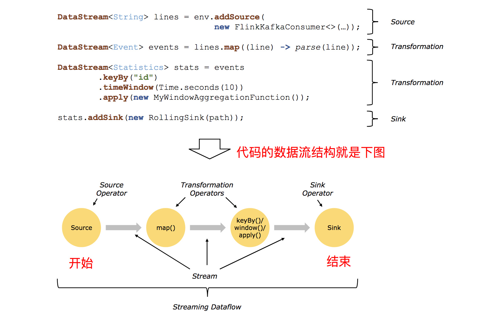

# flink DataStream 的转换

flink 流式处理的程序大体上可以由数据源产生流元素、数据流转换以及数据下沉三个步骤组成，如下图所示



图中的 Source 指代数据源，flink 流处理中的 source 大概有 4 类：基于本地集合的 source、基于文件的 source、基于 socket 的 source、自定义的 source。自定义的 source 常见的有 Apache kafka、Amazon Kinesis Streams、RabbitMQ、Twitter Streaming API、Apache NiFi 等，当然你也可以定义自己的 source

Transformation 指代数据转换的各种操作，有 map、flatMap、filter、keyBy、reduce、fold、aggregations、split、select、project、process、union、connect 等，操作很多，可以将数据转换计算成你想要的数据

图中的 Sink 指代接收器，flink 将转换计算后的数据发送的地点，flink 常见的 Sink 大概有如下几类：写入文件、打印出来、写入 socket、自定义的 sink。自定义的 sink 常见的有 Apache kafka、RabbitMQ、MySQL、ElasticSearch、Apache Cassandra、Hadoop FileSystem 等，同理你也可以定义自己的 Sink

那么这篇文章我们就来看下 flink DataStream 的转换吧（KeyedStream 的各种操作以及各种窗口相关的操作将在后续的文章中讲解）

## map

map 输入一个元素，然后返回一个元素，中间可以做一些清洗转换等操作
	
比如，使用 map 将数据元素乘以 2
	
```java
Integer[] nums = new Integer[]{1, 2, 3, 4};
DataStream<Integer> dataStream = env.fromElements(nums);
	
dataStream.map(new MapFunction<Integer, Integer>() {
    @Override
    public Integer map(Integer value) throws Exception {
        return value * 2;
    }
});
```

接下来看看源码是如何实现的

flink 中有一个 `StreamMap.java` 的文件，位于 `org.apache.flink.streaming.api.operators.StreamMap.java`，StreamMap 是一个 StreamOperator，用于在流元素到来的时候调用定义的 MapFunction，并 emit 处理后的流元素

```java
public class StreamMap<IN, OUT>
		extends AbstractUdfStreamOperator<OUT, MapFunction<IN, OUT>>
		implements OneInputStreamOperator<IN, OUT> {

	private static final long serialVersionUID = 1L;

	public StreamMap(MapFunction<IN, OUT> mapper) {
		super(mapper);
		chainingStrategy = ChainingStrategy.ALWAYS;  // map 会在当前 Thread 内执行
	}

	@Override
	public void processElement(StreamRecord<IN> element) throws Exception {
		output.collect(element.replace(userFunction.map(element.getValue())));
	}
}
```

## flatMap

flatMap 输入一个元素，可以返回零个，一个或者多个元素

比如，使用 flatMap 输出字符串和翻转后的字符串

```java
String[] strings = new String[]{"i", "love", "flink"};
DataStream<String> dataStream = env.fromElements(strings);
dataStream.flatMap(new FlatMapFunction<String, String>() {

    @Override
    public void flatMap(String value, Collector<String> out) throws Exception {
        out.collect(value);
        char[] chs = value.toCharArray();
        int i = 0, j = chs.length - 1;
        while (i < j) {
            char tmp = chs[i];
            chs[i] = chs[j];
            chs[j] = tmp;
            i++;
            j--;
        }
        out.collect(new String(chs));
    }
});
```

接下来看看源码是如何实现的

flink 中有一个 `StreamFlatMap.java` 的文件，位于 `org.apache.flink.streaming.api.operators.StreamFlatMap.java`，StreamFlatMap 是一个 StreamOperator，用于在流元素到来的时候调用定义的 FlatMapFunction，并 emit 处理后的流元素，StreamFlatMap 使用 TimestampedCollector 来保证输出的流元素的 timestamp 全部等于输入的流元素

```java
public class StreamFlatMap<IN, OUT>
		extends AbstractUdfStreamOperator<OUT, FlatMapFunction<IN, OUT>>
		implements OneInputStreamOperator<IN, OUT> {

	private static final long serialVersionUID = 1L;

	private transient TimestampedCollector<OUT> collector;

	public StreamFlatMap(FlatMapFunction<IN, OUT> flatMapper) {
		super(flatMapper);
		chainingStrategy = ChainingStrategy.ALWAYS;  // flatMap 会在当前 Task 内执行
	}

	@Override
	public void open() throws Exception {
		super.open();
		collector = new TimestampedCollector<>(output);  // 保证一条 StreamRecord 的输出有相同的 ts
	}

	@Override
	public void processElement(StreamRecord<IN> element) throws Exception {
		collector.setTimestamp(element);
		userFunction.flatMap(element.getValue(), collector);
	}
}
```

## filter

filter 过滤输入的元素，对传入的数据进行判断，符合条件的数据会被留下

比如，使用 filter 留下偶数
	
```java
Integer[] nums = new Integer[]{1, 2, 3, 4};
DataStream<Integer> dataStream = env.fromElements(nums);
	
dataStream.filter(new FilterFunction<Integer>() {
    @Override
    public boolean filter(Integer value) throws Exception {
        return value % 2 == 0;
    }
});
```

接下来看看源码是如何实现的

flink 中有一个 `StreamFilter.java` 的文件，位于 `org.apache.flink.streaming.api.operators.StreamFilter.java`，StreamFilter 是一个 StreamOperator，用于在流元素到来的时候调用定义的 FilterFunction，并 emit 返回 true 的元素

```java
public class StreamFilter<IN> extends AbstractUdfStreamOperator<IN, FilterFunction<IN>> implements OneInputStreamOperator<IN, IN> {

	private static final long serialVersionUID = 1L;

	public StreamFilter(FilterFunction<IN> filterFunction) {
		super(filterFunction);
		chainingStrategy = ChainingStrategy.ALWAYS;  // filter 会在当前 Thread 内执行
	}

	@Override
	public void processElement(StreamRecord<IN> element) throws Exception {
		if (userFunction.filter(element.getValue())) {
			output.collect(element);  // Collector 接口中的方法
		}
	}
}
```

## process

process 是较为底层的 api，和 flatMap 操作类似，也能够输出零个，一个或者多个元素，process 还可以进行偏侧输出、访问当前的进程时间和 watermark

使用 process 输出字符串以及偏侧输出翻转后的字符串

```java
String[] strings = new String[]{"i", "love", "flink"};
DataStream<String> dataStream = env.fromElements(strings);

OutputTag<String> outputTag = new OutputTag<String>("sideOut") {};

SingleOutputStreamOperator<String> stringSingleOutputStreamOperator = dataStream.process(new ProcessFunction<String, String>() {
    @Override
    public void processElement(String value, Context ctx, Collector<String> out) throws Exception {
        out.collect(value);
        char[] chs = value.toCharArray();
        int i = 0, j = chs.length - 1;
        while (i < j) {
            char tmp = chs[i];
            chs[i] = chs[j];
            chs[j] = tmp;
            i++;
            j--;
        }
        ctx.output(outputTag, new String(chs));
    }
});

stringSingleOutputStreamOperator.print();
stringSingleOutputStreamOperator.getSideOutput(outputTag).printToErr();
```

接下来看看源码（截取重要部分）是如何实现的

flink 中有一个 `ProcessOperator.java` 的文件，位于 `org.apache.flink.streaming.api.operators.ProcessOperator.java`，ProcessOperator 是一个 StreamOperator，用于在流元素到来的时候调用定义的 ProcessFunction，并 emit 处理后的流元素，ProcessOperator 使用 TimestampedCollector 来保证输出的流元素的 timestamp 全部等于输入的流元素，使用 ContextImpl 提供 ProcessOperator 偏侧输出的能力

```java
public class ProcessOperator<IN, OUT>
		extends AbstractUdfStreamOperator<OUT, ProcessFunction<IN, OUT>>
		implements OneInputStreamOperator<IN, OUT> {

	private static final long serialVersionUID = 1L;
	
	private transient TimestampedCollector<OUT> collector;
	
	private transient ContextImpl context;
	
	/** We listen to this ourselves because we don't have an {@link InternalTimerService}. */
	private long currentWatermark = Long.MIN_VALUE;
		
	/**
	 * 构造函数，传入的是 ProcessFunction
	 */
	public ProcessOperator(ProcessFunction<IN, OUT> function) {
		super(function);
	
		chainingStrategy = ChainingStrategy.ALWAYS;
	}
	
	@Override
	public void open() throws Exception {
		super.open();
		// 保证 process emit 的流元素都是相同的时间戳
		collector = new TimestampedCollector<>(output);
	
		context = new ContextImpl(userFunction, getProcessingTimeService());
	}
	
	@Override
	public void processElement(StreamRecord<IN> element) throws Exception {
		collector.setTimestamp(element);
		context.element = element;  // context 记录当前处理的流元素
		userFunction.processElement(element.getValue(), context, collector);
		context.element = null;
	}
	
	private class ContextImpl extends ProcessFunction<IN, OUT>.Context implements TimerService {
		private StreamRecord<IN> element;
	
		private final ProcessingTimeService processingTimeService;
	
		ContextImpl(ProcessFunction<IN, OUT> function, ProcessingTimeService processingTimeService) {
			function.super();
			this.processingTimeService = processingTimeService;
		}

		// 侧边输出
		@Override
		public <X> void output(OutputTag<X> outputTag, X value) {
			if (outputTag == null) {
				throw new IllegalArgumentException("OutputTag must not be null.");
			}
			output.collect(outputTag, new StreamRecord<>(value, element.getTimestamp()));
		}
	}
}	
```

## keyBy

keyBy 用于将 DataStream 按 key 进行分组，得到一个 KeyedStream，有关 KeyedStream 的操作在后续文章中会讲解

将 DataStream 的元素按奇偶数进行分组，然后进行 sum 操作

```java
Integer[] integers = new Integer[]{1, 2, 3, 4};

DataStream<Integer> dataStream = env.fromElements(integers);
KeyedStream<Integer, Integer> keyedStream = dataStream.keyBy(new KeySelector<Integer, Integer>() {
    @Override
    public Integer getKey(Integer value) throws Exception {
        return value % 2;
    }
});

keyedStream.sum(0).printToErr();
```

## split 和 select

split 能够将流拆分为两个或多个流，并且一个元素可以属于拆分后的多个流，select 可以从 split 操作所得的 SplitStream 中获取分组后的流

将 DataStream 按照奇偶数分为两个流

```java
Integer[] integers = new Integer[]{1, 2, 3, 4};

DataStream<Integer> dataStream = env.fromElements(integers);
SplitStream<Integer> splitStream = dataStream.split(new OutputSelector<Integer>() {
    @Override
    public Iterable<String> select(Integer value) {
        ArrayList<String> l = new ArrayList<>();
        if (value % 2 == 0) {
            l.add("even");
        } else {
            l.add("odd");
        }
        return l;
    }
});

DataStream<Integer> selectStream = splitStream.select("even");

selectStream.printToErr();
```

接下来看看源码是如何实现的

split 和 select 操作没有对应的 StreamOperator，split 操作会返回一个 SplitStream，SplitStream 提供 select 的 api，能够通过输入 key 得到分组后的流

```java
public class SplitStream<OUT> extends DataStream<OUT> {

	protected SplitStream(DataStream<OUT> dataStream, OutputSelector<OUT> outputSelector) {
		super(dataStream.getExecutionEnvironment(), new SplitTransformation<OUT>(dataStream.getTransformation(), outputSelector));
	}

	/**
	 * Sets the output names for which the next operator will receive values.
	 *
	 * @param outputNames
	 *            The output names for which the operator will receive the
	 *            input.
	 * @return Returns the selected DataStream
	 */
	/**
	 * split 操作会得到一个 SplitStream，outputSelector 会输出 element 属于的 name 组
	 * select 方法可以通过输入 name 来从流中获取部分元素
	 */
	public DataStream<OUT> select(String... outputNames) {
		return selectOutput(outputNames);
	}

	private DataStream<OUT> selectOutput(String[] outputNames) {
		for (String outName : outputNames) {
			if (outName == null) {
				throw new RuntimeException("Selected names must not be null");
			}
		}

		SelectTransformation<OUT> selectTransform = new SelectTransformation<OUT>(this.getTransformation(), Lists.newArrayList(outputNames));
		return new DataStream<OUT>(this.getExecutionEnvironment(), selectTransform);
	}

}
```

## project

project 从事件流中选择属性子集，并仅将所选元素发送到下一个处理流

```java
DataStream<Tuple4<Integer, Double, String, String>> in = // [...] 
DataStream<Tuple2<String, String>> out = in.project(3,2);

...

(1,10.0,A,B)=> (B,A)
(2,20.0,C,D)=> (D,C)

```

使用 project 返回 k，v 组成的 Tuple2 中的 k

```java
Integer[] integers = new Integer[]{1, 2, 3, 4};

DataStream<Tuple2<Integer, Integer>> dataStream = env.fromElements(integers).map(new MapFunction<Integer, Tuple2<Integer, Integer>>() {
    @Override
    public Tuple2<Integer, Integer> map(Integer value) throws Exception {
        return Tuple2.of(value * 100, value);
    }
});

dataStream.project(0).printToErr();
```

接下来看看源码是如何实现的

flink 中有一个 `StreamProject.java` 的文件，位于 `org.apache.flink.streaming.api.operators. StreamProject.java`，StreamProject 是一个 StreamOperator，当流元素到来的时候，我们根据输入的 fieldIndexs 从流元素中获取相应的字段，组装并 emit 相应的 Tuple

```java
public class StreamProject<IN, OUT extends Tuple>
		extends AbstractStreamOperator<OUT>
		implements OneInputStreamOperator<IN, OUT> {

	private static final long serialVersionUID = 1L;

	private TypeSerializer<OUT> outSerializer;
	private int[] fields;
	private int numFields;

	private transient OUT outTuple;

	public StreamProject(int[] fields, TypeSerializer<OUT> outSerializer) {
		this.fields = fields;
		this.numFields = this.fields.length;
		this.outSerializer = outSerializer;

		chainingStrategy = ChainingStrategy.ALWAYS;
	}

	@Override
	public void processElement(StreamRecord<IN> element) throws Exception {
		for (int i = 0; i < this.numFields; i++) {
			// 这里可以把 element.getValue() 提到循环外面去...
			outTuple.setField(((Tuple) element.getValue()).getField(fields[i]), i);
		}
		output.collect(element.replace(outTuple));
	}

	@Override
	public void open() throws Exception {
		super.open();
		outTuple = outSerializer.createInstance();
	}
}
```

## union

union 用于将两个或多个相同 type 的数据流结合在一起，这样就可以并行地组合数据流。如果我们将一个流与自身组合，那么它会输出每个记录两次

```java
Integer[] integers1 = new Integer[]{1, 2, 3, 4};
Integer[] integers2 = new Integer[]{-1, -2, -3, -4};
    
DataStream<Integer> dataStream = env.fromElements(integers1).union(env.fromElements(integers2));
    
dataStream.printToErr();
```

接下来看看源码是如何实现的

union 操作没有对应的 StreamOperator，union 操作会返回一个包裹 UnionTransformation 的 DataStream，UnionTransformation 存储了所有组合的输入数据流

```java
public class UnionTransformation<T> extends StreamTransformation<T> {
	private final List<StreamTransformation<T>> inputs;

	/**
	 * Creates a new {@code UnionTransformation} from the given input {@code StreamTransformations}.
	 *
	 * <p>The input {@code StreamTransformations} must all have the same type.
	 *
	 * @param inputs The list of input {@code StreamTransformations}
	 */
	public UnionTransformation(List<StreamTransformation<T>> inputs) {
		super("Union", inputs.get(0).getOutputType(), inputs.get(0).getParallelism());

		for (StreamTransformation<T> input: inputs) {
			if (!input.getOutputType().equals(getOutputType())) {
				throw new UnsupportedOperationException("Type mismatch in input " + input);
			}
		}

		this.inputs = Lists.newArrayList(inputs);
	}
}
```

## connect

connect 和 union 类似，这两个操作都是用于组合数据流，但是 union 能够组合 2 个或者多个相同 type 的数据流，connect 操作只能连接两个数据流，但是类型可以不相同

connect 操作返回一个 ConnectedStreams，ConnectedStreams 提供 map、flatMap 以及 process 操作，与前文提到的同名的三个操作类型，就是将 `processElement` 变为 `processElement1` 和 `processElement2`，能够处理两个输入流的元素，这里就不讲解源码了，有兴趣的同学可以去 `org.apache.flink.streaming.api.operators.co` 目录下去查看

```java
Integer[] integers1 = new Integer[]{1, 2, 3, 4};
DataStream<Integer> dataStream1 = env.fromElements(integers1);

String[] strings = new String[]{"i", "love", "flink"};
DataStream<String> dataStream2 = env.fromElements(strings);
    
ConnectedStreams<Integer, String> connectedStreams = dataStream1.connect(dataStream2);
    
connectedStreams.map(new CoMapFunction<Integer, String, String>() {
    @Override
    public String map1(Integer value) throws Exception {
        return String.valueOf(value * 100);
    }

    @Override
    public String map2(String value) throws Exception {
        return value + "heihei";
    }
}).printToErr();
```

## iterate

iterate 操作设置反馈流的终点（即接收反馈元素的节点），数据流执行 iterate 方法会返回一个 IterativeStream，IterativeStream 提供一个 closeWith 的方法，closeWith 接收一个 DataStream 作为参数，参数作为反馈流的起点（即产生反馈元素的节点）

```java
final StreamExecutionEnvironment env = StreamExecutionEnvironment.getExecutionEnvironment();
env.setParallelism(1);

Integer[] integers = new Integer[]{1, 2, 3, 4};

DataStream<Integer> dataStream = env.fromElements(integers);
IterativeStream<Integer> iterativeStream = dataStream.iterate(5000);

SplitStream<Integer> splitStream = iterativeStream.map(new MapFunction<Integer, Integer>() {
    @Override
    public Integer map(Integer value) throws Exception {
        return value * 2;
    }
}).split(new OutputSelector<Integer>() {
    @Override
    public Iterable<String> select(Integer value) {
        ArrayList<String> l = new ArrayList<>();
        if (value > 10) {
            l.add("output");
        } else {
            l.add("iterate");
        }

        return l;
    }
});

iterativeStream.closeWith(splitStream.select("iterate"));
splitStream.select("output").printToErr();
```

上面的栗子，当元素大于 10 的时候输出到错误流，反之，进行迭代，需要注意的是，只有并行度相同的时候，才能调用 closeWith 方法（上文栗子中使用 `env.setParallelism(1)` 设置环境的并行度为 1，否则需要设置 iterativeStream 的并行度为环境的并行度），反馈操作不涉及 StreamOperator，是通过 BlockingQueue 在 StreamTask 的时候实现的（后续会有文章介绍）

## 总结

本文主要介绍了 flink DataStream 的常用转换方式，每一个算子都有配套的小 demo 和源码分析，具体在项目中该如何将数据流转换成我们想要的格式，还需要根据实际情况对待

## 参考

本文开头的流程图来自[《从0到1学习Flink》—— Flink Data transformation(转换)](http://www.54tianzhisheng.cn/2018/11/04/Flink-Data-transformation/#Union)

