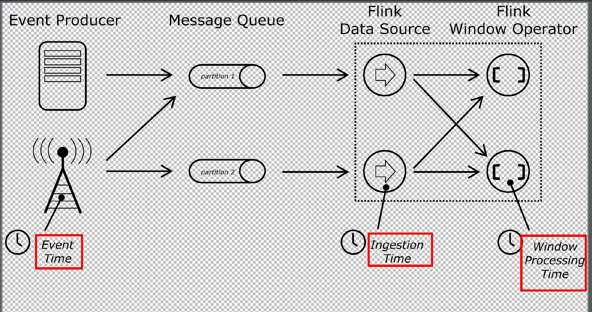
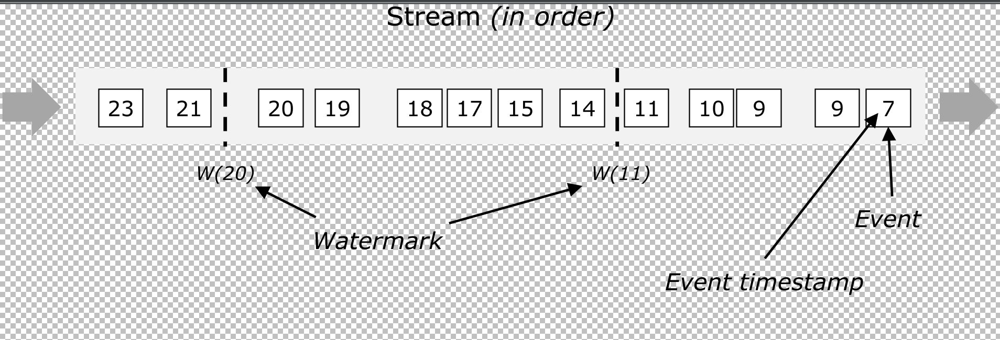
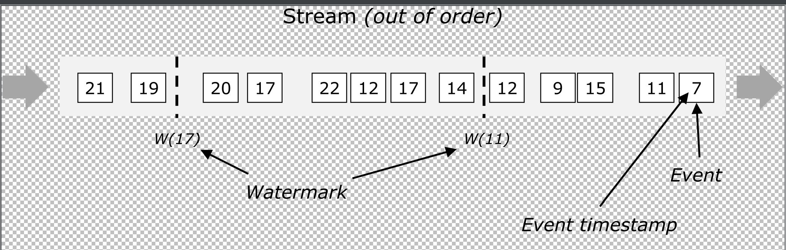

# flink 中的时间

flink 在流程序中，支持不同概念的时间，在源码中，对应的定义位于 `org.apache.flink.streaming.api.TimeCharacteristic.java` 中

flink 默认使用 Processing Time，可以通过 `env.setStreamTimeCharacteristic(TimeCharacteristic.EventTime)` 设置为使用 Event Time

下面我们分别来看看这几种 Time

## Processing Time

Processing Time 是指事件被处理时机器的系统时间

当流程序在 Processing Time 上运行时，所有基于时间的操作（如时间窗口）将使用当时机器的系统时间（默认使用 System.currentTimeMillis 获取当前机器的系统时间）

举个栗子，窗口以 Processing Time 模式运行，如果应用程序在上午 9:15 开始运行，则第一个每小时 Processing Time 窗口将包括在上午 9:15 到上午 10:00 之间处理的事件，下一个窗口将包括在上午 10:00 到 11:00 之间处理的事件

Processing Time 是最简单的 "Time" 概念，不需要流和机器之间的协调，它提供了最好的性能和最低的延迟。但是，在分布式和异步的环境下，Processing Time 不能提供确定性，因为它容易受到事件到达系统的速度（例如从消息队列）、事件在系统内操作流动的速度以及中断的影响

## Event Time

Event Time 是事件发生的时间，一般就是数据本身携带的时间。这个时间通常是在事件到达 flink 之前就确定的，并且可以从每个事件中获取到事件时间戳。在 Event Time 中，时间取决于数据，而跟其他没什么关系。Event Time 程序必须指定如何生成 Event Time 水印，这是表示 Event Time 进度的机制

理想状况下，无论事件什么时候到达或者其怎么排序，最后处理 Event Time 将产生完全一致和确定的结果。但是，除非事件按照已知顺序（按照事件的时间）到达，否则处理 Event Time 时将会因为要等待一些无序事件而产生一些延迟。由于只能等待一段有限的时间，因此就难以保证处理 Event Time 将产生完全一致和确定的结果

假设所有数据都已到达，Event Time 操作将按照预期运行，即使在处理无序事件、延迟事件、重新处理历史数据时也会产生正确且一致的结果。例如，每小时事件时间窗口将包含带有落入该小时的事件时间戳的所有记录，无论它们到达的顺序如何

请注意，有时当 Event Time 程序实时处理实时数据时，它们将使用一些 Processing Time 操作，以确保它们及时进行

## Ingestion Time

Ingestion Time 是事件进入 flink 的时间。在源操作处，每个事件将源的当前时间作为时间戳，并且基于时间的操作（如时间窗口）会利用这个时间戳

Ingestion Time 在概念上位于 Event Time 和 Processing Time 之间。 与 Processing Time 相比，它稍微贵一些，但结果更可预测。因为 Ingestion Time 使用稳定的时间戳（在源处分配一次），所以对事件的不同窗口操作将引用相同的时间戳，而在 Processing Time 中，每个窗口操作符可以将事件分配给不同的窗口（基于机器系统时间和到达延迟）

与 Event Time 相比，Ingestion Time 程序无法处理任何无序事件或延迟数据，但程序不必指定如何生成水印

在 flink 中，Ingestion Time 与 Event Time 非常相似，但 Ingestion Time 具有自动分配时间戳和自动生成水印功能

## 表明三种 Time 概念的图



## Event Time 和 WaterMarks

支持 Event Time 的流处理器需要一种方法来衡量 Event Time 的进度。 例如，当 Event Time 超过一小时结束时，需要通知构建每小时窗口的窗口操作符，以便操作员可以关闭正在进行的窗口

Event Time 可以独立于 Processing Time 进行。 例如，在一个程序中，操作员的当前 Event Time 可能略微落后于 Processing Time（考虑到接收事件的延迟），而两者都以相同的速度进行。另一方面，另一个流程序可能只需要几秒钟的时间就可以处理完 Kafka Topic 中数周的 Event Time 数据

flink 中用于衡量 Event Time 进度的机制是 Watermarks。Watermarks 作为数据流的一部分流动并带有时间戳 t。Watermark（t）声明 Event Time 已到达该流中的时间 t，这意味着流中不应再有具有时间戳 t’ <= t 的元素（即时间戳大于或等于水印的事件）

水印是在源函数处生成的，或直接在源函数之后生成的。源函数的每个并行子任务通常独立生成其水印。这些水印定义了特定并行源处的事件时间

下图显示了带有时间戳和内联水印的事件流。在本例中，事件是按顺序排列的（相对于它们的时间戳），这意味着水印只是流中的周期性标记



Watermark 对于无序流是至关重要的，如下所示，其中事件不按时间戳排序。通常，Watermark 是一种声明，通过流中的该点，到达某个时间戳的所有事件都应该到达。一旦水印到达操作员，操作员就可以将其内部事件时间提前到水印的值



## StreamSourceContexts 中如何处理时间

flink 是一个流式处理程序，那么肯定需要从源头获取数据，在 `org.apache.flink.streaming.api.operators.StreamSource.java` 中，会调用 `userFunction.run(ctx)`，userFunction 是用户定义的 SourceFunction，run 方法把源头的数据写入 flink，ctx 参数就是 StreamSourceContexts 实例，根据 flink 的 TimeCharacteristic 模式，处理流元素的 Time

### Processing Time 模式下的 StreamSourceContexts

```java
public void collect(T element) {
	synchronized (lock) {
		output.collect(reuse.replace(element));
	}
}

@Override
public void collectWithTimestamp(T element, long timestamp) {
	// ignore the timestamp
	// 忽略 ts
	collect(element);
}

@Override
public void emitWatermark(Watermark mark) {
	// do nothing
}
```

由于 Processing Time 模式下，所有与时间相关的操作都以机器时间为准，所以 flink 会忽略掉元素的 timestamp，并且不处理与 watermark 相关的操作

### Event Time 模式下的 StreamSourceContexts

```java
@Override
protected void processAndCollect(T element) {
	output.collect(reuse.replace(element));
}

@Override
protected void processAndCollectWithTimestamp(T element, long timestamp) {
	output.collect(reuse.replace(element, timestamp));
}

@Override
protected void processAndEmitWatermark(Watermark mark) {
	output.emitWatermark(mark);
}

@Override
protected boolean allowWatermark(Watermark mark) {
	return true;
}
```

这里可以看到，Event Time 模式下，需要手动 emit 带 timestamp 的流元素，以及手动的 emit watermark，上面我们说过

> 水印是在源函数处生成的，或直接在源函数之后生成的

这里就是源函数生成水印的方法

### Ingestion Time 模式下的 StreamSourceContexts

```java
@Override
protected void processAndCollect(T element) {
	lastRecordTime = this.timeService.getCurrentProcessingTime();
	output.collect(reuse.replace(element, lastRecordTime));  // 时间戳定义为机器现在的时间

	// this is to avoid lock contention in the lockingObject by
	// sending the watermark before the firing of the watermark
	// emission task.
	// 捎带传输一波，避免锁竞争
	// 在 emit StreamRecord 的时候，检查当前时间内是否大于下一次发送 watermark 的时候
	// 如果大于，则避免进行 nextWatermarkTimer 的调度，直接 emit 一个 watermark 完事
	if (lastRecordTime > nextWatermarkTime) {
		// in case we jumped some watermarks, recompute the next watermark time
		// 这里需要重新计算，目的是为了下一次 emit watermark 是 watermarkInterval 的整数倍
		final long watermarkTime = lastRecordTime - (lastRecordTime % watermarkInterval);
		nextWatermarkTime = watermarkTime + watermarkInterval;
		output.emitWatermark(new Watermark(watermarkTime));

		// we do not need to register another timer here
		// because the emitting task will do so.
	}
}

@Override
/**
 * IngestionTime 模式用机器当前时间来设置 ts		
 */
protected void processAndCollectWithTimestamp(T element, long timestamp) {
	processAndCollect(element);
}

@Override
/**
 * 流已经没有数据，发送一个 value 为 LONG.MAX_VALUE 的 watermark 告诉 operators
 */
protected boolean allowWatermark(Watermark mark) {
	// allow Long.MAX_VALUE since this is the special end-watermark that for example the Kafka source emits
	return mark.getTimestamp() == Long.MAX_VALUE && nextWatermarkTime != Long.MAX_VALUE;
}

/** This will only be called if allowWatermark returned {@code true}. */
/**
 * 仅仅当 allowWatermark 方法返回 true 的时候
 * 调用 processAndEmitWatermark 方法，本方法仅当流没有数据的时候，调用一次
 */
@Override
protected void processAndEmitWatermark(Watermark mark) {
	nextWatermarkTime = Long.MAX_VALUE;
	output.emitWatermark(mark);

	// we can shutdown the watermark timer now, no watermarks will be needed any more.
	// Note that this procedure actually doesn't need to be synchronized with the lock,
	// but since it's only a one-time thing, doesn't hurt either
	// 发送了 value 为 Long.MAX_VALUE 的最后一个 watermark，不需要再发送 watermark 了，可以 cancel 定时器
	final ScheduledFuture<?> nextWatermarkTimer = this.nextWatermarkTimer;
	if (nextWatermarkTimer != null) {
		nextWatermarkTimer.cancel(true);
	}
}

private class WatermarkEmittingTask implements ProcessingTimeCallback {

	private final ProcessingTimeService timeService;
	private final Object lock;
	private final Output<StreamRecord<T>> output;

	private WatermarkEmittingTask(
			ProcessingTimeService timeService,
			Object checkpointLock,
			Output<StreamRecord<T>> output) {
		this.timeService = timeService;
		this.lock = checkpointLock;
		this.output = output;
	}

	@Override
	public void onProcessingTime(long timestamp) {
		// 时间用统一的，避免不同机器时间不对
		final long currentTime = timeService.getCurrentProcessingTime();

		synchronized (lock) {
			// we should continue to automatically emit watermarks if we are active
			// 如果 Stream 是 active 的，我们应该持续自动 emit watermark
			if (streamStatusMaintainer.getStreamStatus().isActive()) {
				if (idleTimeout != -1 && currentTime - lastRecordTime > idleTimeout) {
					// if we are configured to detect idleness, piggy-back the idle detection check on the
					// watermark interval, so that we may possibly discover idle sources faster before waiting
					// for the next idle check to fire
					// 在这里检测有可能能更早的发现 Stream 空闲
					markAsTemporarilyIdle();

					// no need to finish the next check, as we are now idle.
					// 没有必要进行下一次的流状态检测，因为流现在已经是空闲的了
					cancelNextIdleDetectionTask();
				} else if (currentTime > nextWatermarkTime) {
					// align the watermarks across all machines. this will ensure that we
					// don't have watermarks that creep along at different intervals because
					// the machine clocks are out of sync
					final long watermarkTime = currentTime - (currentTime % watermarkInterval);

					output.emitWatermark(new Watermark(watermarkTime));
					nextWatermarkTime = watermarkTime + watermarkInterval;
				}
			}
		}

		// 注册下一次 emit watermark 的定时器
		long nextWatermark = currentTime + watermarkInterval;
		nextWatermarkTimer = this.timeService.registerTimer(
				nextWatermark, new WatermarkEmittingTask(this.timeService, lock, output));
	}
}
```

前面我们说过，Event Time 需要手动 emit 带 timestamp 的元素以及 watermark，Ingestion Time 模式将元素进入 flink 的时间作为元素的 timestamp，同时，Ingestion Time 模式会按照 flink 配置中的 watermarkInterval 周期性的 emit watermark，这里代码较长，我们分函数来讲解一下

#### processAndCollect

首选，函数获取机器的当前时间，然后设置流元素的 timestamp 为当前时间，因为 Ingestion Time 模式需要定时 emit watermark，所以肯定会有一个下一次 emit watermark 的时间，即 nextWatermarkTime，可以看到在 processAndCollect 方法中，当 `lastRecordTime > nextWatermarkTime` 的时候，说明时间已经到了，但是由于延迟，还没有 emit watermark，所以这里直接发出并且更新 nextWatermarkTime

#### allowWatermark

由于 Ingestion Time 模式定时 emit watermark，因此正常情况下不需要手动 emit watermark，当 allowWatermark 参数中 watermark 的时间戳为 Long.MAX_VALUE 的时候，说明没有更多元素了，这里我们手动 emit 一个最终的 watermark

#### processAndEmitWatermark

手动 emit 最终的 watermark 之后，取消定时 emit watermark 的定时器

#### WatermarkEmittingTask

WatermarkEmittingTask 就是定时器的一个回调函数，当定时器触发的时候，emit 一个 watermark，可以从代码中看到，flink 会比较 `currentTime > nextWatermarkTime`，所以在 processAndCollect 中如果已经发出过 watermark，这里是不会做任何操作的，最后再注册下一次定时器即可

## 源函数之后如何生成 watermark

> 水印是在源函数处生成的，或直接在源函数之后生成的

这里来讲一下如何在源函数之后生成 watermark，在 `org.apache.flink.streaming.api.datastream.DataStream.java` 中有两个方法，`assignTimestamps`、`assignTimestampsAndWatermarks` 就是用来做这个事情的，`assignTimestamps` 已经被打上 `Deprecated` 标志了，这里就不讲解了，下面我们来分析一下 `assignTimestampsAndWatermarks ` 方法

### 参数接收 AssignerWithPeriodicWatermarks 的 assignTimestampsAndWatermarks

本 assignTimestampsAndWatermarks 方法周期性的 emit watermark

```java
public SingleOutputStreamOperator<T> assignTimestampsAndWatermarks(
		AssignerWithPeriodicWatermarks<T> timestampAndWatermarkAssigner) {

	// match parallelism to input, otherwise dop=1 sources could lead to some strange
	// behaviour: the watermark will creep along very slowly because the elements
	// from the source go to each extraction operator round robin.
	/**
	 * 将并行性与输入相匹配，否则 dop = 1 源可能会导致一些奇怪的行为：
	 * 水印将会非常缓慢地蠕变，因为源中的元素会转到每个提取运算符循环
	 */
	final int inputParallelism = getTransformation().getParallelism();
	final AssignerWithPeriodicWatermarks<T> cleanedAssigner = clean(timestampAndWatermarkAssigner);

	TimestampsAndPeriodicWatermarksOperator<T> operator =
			new TimestampsAndPeriodicWatermarksOperator<>(cleanedAssigner);

	return transform("Timestamps/Watermarks", getTransformation().getOutputType(), operator)
			.setParallelism(inputParallelism);
}
```

AssignerWithPeriodicWatermarks 是一个接口，提供了两个方法

* Watermark getCurrentWatermark()：获取当前的 watermark
* long extractTimestamp(T element, long previousElementTimestamp)：从 element 中提取 timestamp

TimestampsAndPeriodicWatermarksOperator 是**定时 emit 一个 watermark**，和 Ingestion Time 模式很像，`org.apache.flink.streaming.api.functions.IngestionTimeExtractor.java` 实现了 AssignerWithPeriodicWatermarks 接口，提供和 Ingestion Time 类似的语义

👇看看 TimestampsAndPeriodicWatermarksOperator 的实现，open 方法中注册了一个定时器，定时器触发的时候，调用 onProcessingTime 方法，判断是否需要 emit watermark，同时注册下一个定时器。processElement 给到来的流元素加上 timestamp，然后 output 输出。由于是定时 emit watermark，因此 processWatermark 仅仅处理 `mark.getTimestamp() == Long.MAX_VALUE` 的 watermark，因为这代表没有更多元素了

```java
public class TimestampsAndPeriodicWatermarksOperator<T>
		extends AbstractUdfStreamOperator<T, AssignerWithPeriodicWatermarks<T>>
		implements OneInputStreamOperator<T, T>, ProcessingTimeCallback {

	private static final long serialVersionUID = 1L;

	private transient long watermarkInterval;

	private transient long currentWatermark;

	public TimestampsAndPeriodicWatermarksOperator(AssignerWithPeriodicWatermarks<T> assigner) {
		super(assigner);
		this.chainingStrategy = ChainingStrategy.ALWAYS;
	}

	@Override
	public void open() throws Exception {
		super.open();

		currentWatermark = Long.MIN_VALUE;  // 初始化当前水印
		// 获取定时生成水印的间隔
		watermarkInterval = getExecutionConfig().getAutoWatermarkInterval();

		if (watermarkInterval > 0) {
			long now = getProcessingTimeService().getCurrentProcessingTime();
			getProcessingTimeService().registerTimer(now + watermarkInterval, this);
		}
	}

	@Override
	public void processElement(StreamRecord<T> element) throws Exception {
		final long newTimestamp = userFunction.extractTimestamp(element.getValue(),
				element.hasTimestamp() ? element.getTimestamp() : Long.MIN_VALUE);

		output.collect(element.replace(element.getValue(), newTimestamp));
	}

	@Override
	public void onProcessingTime(long timestamp) throws Exception {
		// register next timer
		Watermark newWatermark = userFunction.getCurrentWatermark();
		if (newWatermark != null && newWatermark.getTimestamp() > currentWatermark) {
			currentWatermark = newWatermark.getTimestamp();
			// emit watermark
			// 发出水印
			output.emitWatermark(newWatermark);
		}

		// 注册下一个定时器，emit watermark
		long now = getProcessingTimeService().getCurrentProcessingTime();
		getProcessingTimeService().registerTimer(now + watermarkInterval, this);
	}

	/**
	 * Override the base implementation to completely ignore watermarks propagated from
	 * upstream (we rely only on the {@link AssignerWithPeriodicWatermarks} to emit
	 * watermarks from here).
	 */
	/**
	 * 覆盖基础实现以完全忽略从上游传播的水印（我们仅依靠AssignerWithPeriodicWatermarks从此处发出水印）
	 */
	@Override
	public void processWatermark(Watermark mark) throws Exception {
		// if we receive a Long.MAX_VALUE watermark we forward it since it is used
		// to signal the end of input and to not block watermark progress downstream
		// 如果我们收到Long.MAX_VALUE水印，我们转发它，因为它用于表示输入的结束并且不阻止下游的水印进度
		if (mark.getTimestamp() == Long.MAX_VALUE && currentWatermark != Long.MAX_VALUE) {
			currentWatermark = Long.MAX_VALUE;
			output.emitWatermark(mark);
		}
	}

	@Override
	public void close() throws Exception {
		super.close();

		// emit a final watermark
		Watermark newWatermark = userFunction.getCurrentWatermark();
		if (newWatermark != null && newWatermark.getTimestamp() > currentWatermark) {
			currentWatermark = newWatermark.getTimestamp();
			// emit watermark
			output.emitWatermark(newWatermark);
		}
	}
}
```

### 参数接收 AssignerWithPunctuatedWatermarks 的 assignTimestampsAndWatermarks

本 assignTimestampsAndWatermarks 根据到来的元素进行判断是否需要 emit watermark（用户自己实现），不是一个定时的操作

```java
public SingleOutputStreamOperator<T> assignTimestampsAndWatermarks(
		AssignerWithPunctuatedWatermarks<T> timestampAndWatermarkAssigner) {

	// match parallelism to input, otherwise dop=1 sources could lead to some strange
	// behaviour: the watermark will creep along very slowly because the elements
	// from the source go to each extraction operator round robin.
	final int inputParallelism = getTransformation().getParallelism();
	final AssignerWithPunctuatedWatermarks<T> cleanedAssigner = clean(timestampAndWatermarkAssigner);

	TimestampsAndPunctuatedWatermarksOperator<T> operator =
			new TimestampsAndPunctuatedWatermarksOperator<>(cleanedAssigner);

	return transform("Timestamps/Watermarks", getTransformation().getOutputType(), operator)
			.setParallelism(inputParallelism);
}
```

AssignerWithPunctuatedWatermarks 同样是一个接口，也提供了两个方法

* Watermark checkAndGetNextWatermark(T lastElement, long extractedTimestamp)：决定是否 emit watermark，lastElement 是到来的元素，extractedTimestamp 是调用 extractTimestamp 方法获取的 ts
* long extractTimestamp(T element, long previousElementTimestamp)：从 element 中提取 timestamp

TimestampsAndPunctuatedWatermarksOperator 是**根据到来的流元素判断是否 emit 一个 watermark**的操作符

👇看看 TimestampsAndPunctuatedWatermarksOperator 的实现，可以看到 processElement 方法首先给流元素设置 timestamp，然后调用 checkAndGetNextWatermark 方法判断是否需要 emit watermark。同理，processWatermark 仅仅处理 `mark.getTimestamp() == Long.MAX_VALUE` 的 watermark，因为这代表没有更多元素了

```java
public class TimestampsAndPunctuatedWatermarksOperator<T>
		extends AbstractUdfStreamOperator<T, AssignerWithPunctuatedWatermarks<T>>
		implements OneInputStreamOperator<T, T> {

	private static final long serialVersionUID = 1L;

	private long currentWatermark = Long.MIN_VALUE;

	public TimestampsAndPunctuatedWatermarksOperator(AssignerWithPunctuatedWatermarks<T> assigner) {
		super(assigner);
		this.chainingStrategy = ChainingStrategy.ALWAYS;
	}

	@Override
	public void processElement(StreamRecord<T> element) throws Exception {
		final T value = element.getValue();
		final long newTimestamp = userFunction.extractTimestamp(value,
				element.hasTimestamp() ? element.getTimestamp() : Long.MIN_VALUE);

		output.collect(element.replace(element.getValue(), newTimestamp));

		final Watermark nextWatermark = userFunction.checkAndGetNextWatermark(value, newTimestamp);
		if (nextWatermark != null && nextWatermark.getTimestamp() > currentWatermark) {
			currentWatermark = nextWatermark.getTimestamp();
			output.emitWatermark(nextWatermark);
		}
	}

	/**
	 * Override the base implementation to completely ignore watermarks propagated from
	 * upstream (we rely only on the {@link AssignerWithPunctuatedWatermarks} to emit
	 * watermarks from here).
	 */
	/**
	 * 覆盖基础实现以完全忽略从上游传播的水印（我们仅依靠AssignerWithPeriodicWatermarks从此处发出水印）
	 */
	@Override
	public void processWatermark(Watermark mark) throws Exception {
		// if we receive a Long.MAX_VALUE watermark we forward it since it is used
		// to signal the end of input and to not block watermark progress downstream
		// 如果我们收到Long.MAX_VALUE水印，我们转发它，因为它用于表示输入的结束并且不阻止下游的水印进度
		if (mark.getTimestamp() == Long.MAX_VALUE && currentWatermark != Long.MAX_VALUE) {
			currentWatermark = Long.MAX_VALUE;
			output.emitWatermark(mark);
		}
	}
}
```

## 总结

本文介绍了 flink 中的各种时间 —— ProcessingTime、EventTime 以及 IngestionTime，然后介绍了与 EventTime 联系紧密的 watermark，最后介绍了 flink 是如何处理流元素的 timestamp 以及如何生成 watermark，希望对您有所帮助～

## 参考

[《从0到1学习Flink》—— Flink 中几种 Time 详解](http://www.54tianzhisheng.cn/2018/12/11/Flink-time/)